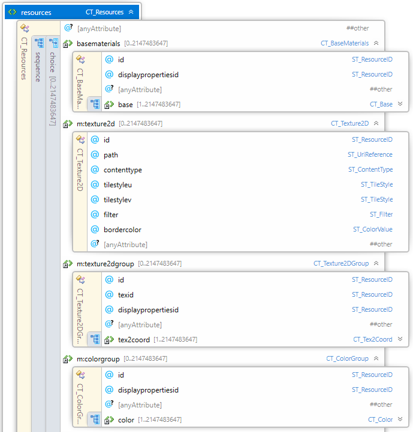
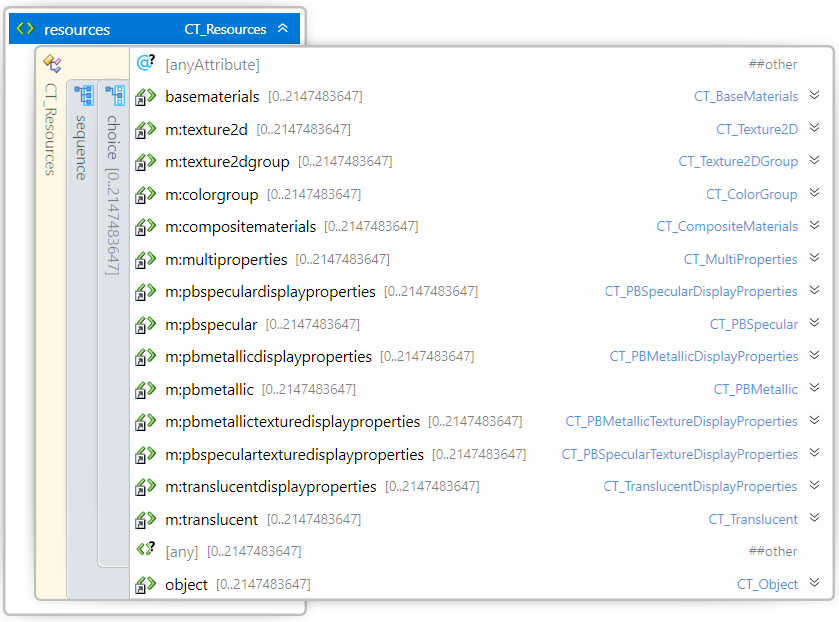
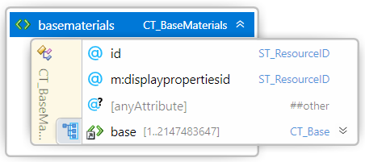
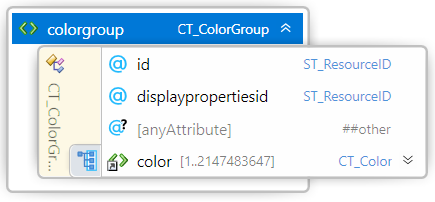
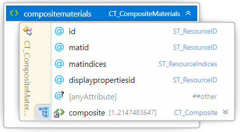
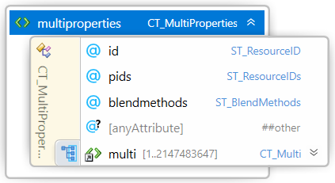
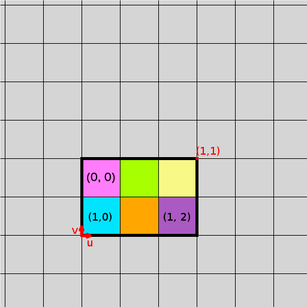

#  3D Manufacturing Format

# Materials and Properties Extension

| **Version** | 1.2.1 |
| --- | --- |
| **Status** | Published |


## Disclaimer

THESE MATERIALS ARE PROVIDED "AS IS." The contributors expressly disclaim any warranties (express, implied, or otherwise), including implied warranties of merchantability, non-infringement, fitness for a particular purpose, or title, related to the materials. The entire risk as to implementing or otherwise using the materials is assumed by the implementer and user. IN NO EVENT WILL ANY MEMBER BE LIABLE TO ANY OTHER PARTY FOR LOST PROFITS OR ANY FORM OF INDIRECT, SPECIAL, INCIDENTAL, OR CONSEQUENTIAL DAMAGES OF ANY CHARACTER FROM ANY CAUSES OF ACTION OF ANY KIND WITH RESPECT TO THIS DELIVERABLE OR ITS GOVERNING AGREEMENT, WHETHER BASED ON BREACH OF CONTRACT, TORT (INCLUDING NEGLIGENCE), OR OTHERWISE, AND WHETHER OR NOT THE OTHER MEMBER HAS BEEN ADVISED OF THE POSSIBILITY OF SUCH DAMAGE.


## Table of Contents

- [Preface](#preface)
  * [About this Specification](#about-this-specification)
  * [Document Conventions](#document-conventions)
  * [Language Notes](#language-notes)
  * [Software Conformance](#software-conformance)
- [Part I. 3MF Documents](#part-i-3mf-documents)
  * [Chapter 1. Overview of Additions](#chapter-1-overview-of-additions)
    + [1.1. Resources](#11-resources)
    + [1.2. sRGB and Linear Color Values](#12-srgb-and-linear-color-values)
    + [1.3. Material Gradients and Interpolation Methods](#13-material-gradients-and-interpolation-methods)
    + [1.4. Base Materials](#14-base-materials)
  * [Chapter 2. Color Groups](#chapter-2-color-groups)
    + [2.1. Color](#21-color)
  * [Chapter 3. Texture 2D Groups](#chapter-3-texture-2d-groups)
    + [3.1. Texture 2D Coordinate](#31-texture-2d-coordinate)
  * [Chapter 4. Composite Materials](#chapter-4-composite-materials)
    + [4.1. Composite](#41-composite)
  * [Chapter 5. Multiproperties](#chapter-5-multiproperties)
    + [5.1. Multi](#51-multi)
  * [Chapter 6. Texture 2d](#chapter-6-texture-2d)
  * [Chapter 7. Display Properties Overview](#chapter-7-display-properties-overview)
    + [7.1. Specular Display Properties](#71-specular-display-properties)
      - [7.1.1. Specular](#711-specular)
    + [7.2. Metallic Display Properties](#72-metallic-display-properties)
      - [7.2.1. Metallic](#721-metallic)
    + [7.3. Specular Texture Display Properties](#73-specular-texture-display-properties)
    + [7.4. Metallic Texture Display Properties](#74-metallic-texture-display-properties)
    + [7.5. Translucent Display Properties](#75-translucent-display-properties)
      - [7.5.1. Translucent](#751-translucent)
- [Part II. Appendixes](#part-ii-appendixes)
  * [Appendix A. Glossary](#appendix-a-glossary)
  * [Appendix B. 3MF XSD Schema for Material and Properties](#appendix-b-3mf-xsd-schema-for-material-and-properties)
  * [Appendix C. 3MF Samples](#appendix-c-3mf-samples)
    + [C.1. Physically Based Material Sample](#c1-physically-based-material-sample)
    + [C.2. Translucent Material Sample](#c2-translucent-material-sample)
  * [Appendix D. Micro-facet Surface Model and BRDF](#appendix-d-micro-facet-surface-model-and-brdf)
    + [D.1. Normal Distribution Function – D(h)](#d1-normal-distribution-function-%E2%80%93-dh)
    + [D.2. Geometric Occlusion Term – G(l, v, h)](#d2-geometric-occlusion-term-%E2%80%93-gl-v-h)
    + [D.3. Fresnel Term – F(l, h)](#d3-fresnel-term-%E2%80%93-fl-h)
  * [Appendix E. Standard Namespaces and Content Types](#appendix-e-standard-namespaces-and-content-types)
    + [E.1 Content Types](#e1-content-types)
    + [E.2 Relationship Types](#e2-relationship-types)
    + [E.3 Namespaces](#e3-namespaces)
- [References](#references)

# Preface

## About this Specification
This 3MF materials and properties specification is an extension to the core 3MF specification. This document cannot stand alone and only applies as an addendum to the core 3MF specification. Usage of this and any other 3MF extensions follow an a la carte model, defined in the core 3MF specification.

Part I, “3MF Documents,” presents the details of the primarily XML-based 3MF Document format. This section describes the XML markup that defines the composition of 3D documents and the appearance of each model within the document.

Part II, “Appendixes,” contains additional technical details and schemas too extensive to include in the main body of the text as well as convenient reference information.

The information contained in this specification is subject to change. Every effort has been made to ensure its accuracy at the time of publication.

This extension MUST be used only with Core specification 1.2.

## Document Conventions

See [the 3MF Core Specification conventions](https://github.com/3MFConsortium/spec_core/blob/1.2.3/3MF%20Core%20Specification.md#document-conventions).

In this extension specification, as an example, the prefix "m" maps to the xml-namespace "http://schemas.microsoft.com/3dmanufacturing/material/2015/02". See Appendix [E.3 Namespaces](#e3-namespaces).

## Language Notes

See [the 3MF Core Specification language notes](https://github.com/3MFConsortium/spec_core/blob/1.2.3/3MF%20Core%20Specification.md#language-notes).

## Software Conformance

See [the 3MF Core Specification software conformance](https://github.com/3MFConsortium/spec_core/blob/1.2.3/3MF%20Core%20Specification.md#software-conformance).

# Part I. 3MF Documents

## Chapter 1. Overview of Additions




This chapter describes new non-object resources. Each of these resources is OPTIONAL for producers but MUST be supported by consumers that specify support for this materials extension of 3MF.

As a general idea, the following resource groups will determine different ways of representing material properties of a part. The corresponding resource IDs MAY be referenced by triangle attributes defined in the core specification.

As there are existing file formats and use cases which need multiple pieces of information per triangle, it is possible to define multiple properties per triangle (see [Chapter 5. Multiproperties](#chapter-5-multiproperties)). Consumers MUST be strict in obeying the mixing rules as laid out in the corresponding paragraphs to avoid ambiguous interpretation of the design intent.


### 1.1. Resources

Element **\<resources>**



All the new elements defined in this 3MF extension specification live under the \<resources> element from the core 3MF specification. The \<object> and \<basematerials> elements are from the core spec, while the rest are defined in the following chapters. The ordering shown here is not enforced in the schema, as these extension elements all fall under the \<any> element from the core spec.

### 1.2. sRGB and Linear Color Values

The 3MF core specification ([5.1. Base Material](https://github.com/3MFConsortium/spec_core/blob/1.2.3/3MF%20Core%20Specification.md#51-base-material)) mentions that whenever 3MF uses colors that are expressed as #RRGGBB hexadecimal quantities with 8 bits per color channel, they are assumed to be in sRGB color space. 3MF uses sRGB as specified by the World Wide Web Consortium (http://www.w3.org/Graphics/Color/sRGB).

Since human perception of brightness changes approximately with the logarithm of object's actual brightness, color data is usually encoded using a non-linear color component transfer. Such encoding is used to optimize the usage of bits, especially when individual R, G, B color channels are expressed as 8-bit quantities, as is the case with JPEG and PNG formats.

For inverse transformation to take place, it is necessary to obtain a normalized C_sRGB color triplet by dividing each channel by 255 (or 2<sup>n</sup>-1, where n is the number of bits per channel):

    C_sRGB = {R_sRGB, G_sRGB, B_sRGB} = { #RR/255, #GG/255, #BB/255 }

Where C_sRGB is an sRGB color triplet not including the alpha channel, with elements normalized to [0, 1] range.

The inverse transformation from sRGB color space to linear space is defined as:


This equation MUST be applied separately to each channel in the C_sRGB triplet to create the C_linear triplet.

    C_linear = {R_linear, G_linear, B_linear}

Where R_linear, G_linear, B_linear are separately calculated from the associated R_sRGB, G_sRGB, B_sRGB values using the above formula.

For this specification, this transformation is called the inverse color component transfer function. Unless specified otherwise, a client SHOULD perform a vertex color interpolation and a texture interpolation in sRGB, but apply the inverse color component transfer function to sRGB colors before multi-properties color blending takes place. Those blending operations SHOULD be performed in linear RGB space. This corresponds to common practices in Computer Graphics and hardware supported rendering operations.

The forward color component transfer function from linear to sRGB color space is defined as:


This equation MUST be applied separately to each channel in the C_linear  triplet. sRGB values should be kept in the [0, 1] range while applying interpolations. To return sRGB to an 8-bit triplet (before persisting to disk, for example), it is necessary to multiply each channel by the required bits per channel (255, for 8-bit) and round to the nearest integer.

### 1.3. Material Gradients and Interpolation Methods

The 3MF core specification ([4.1.4 Triangles](https://github.com/3MFConsortium/spec_core/blob/1.2.3/3MF%20Core%20Specification.md#414-triangles)) describes properties e.g. color to be specified for each vertex of a triangle. Specifically, an sRGB triplet can be assigned to each vertex of a triangle. Color gradients within a triangle should be calculated by performing a linear interpolation in sRGB using barycentric coordinates. Performing color vertex interpolations in sRGB space corresponds to common practices in 2D and 3D imaging applications and is closer to an interpolation in a perceptual uniform space than an interpolation in a linear RGB space would be. 

### 1.4. Base Materials 

The 3MF core specification ([Chapter 5: Material Resources](https://github.com/3MFConsortium/spec_core/blob/1.2.3/3MF%20Core%20Specification.md#chapter-5-material-resources)) describes a base material type. This extension adds an additional attribute to the base material element representing display properties that allow realistic rendering of materials to a display.

Element **\<basematerials>**



##### Attributes
| Name | Type | Use | Default | Annotation |
| --- | --- | --- | --- | --- |
| displaypropertiesid | **ST_ResourceID** | optional | | Reference to a \<displayproperties> element providing additional information about how to display the material on a device display |

The displaypropertiesid attribute references a \<displayproperties> group containing additional properties that describe how best to display a mesh with this material on a device display.

## Chapter 2. Color Groups

Element **\<colorgroup>**



##### Attributes
| Name | Type | Use | Default | Annotation |
| --- | --- | --- | --- | --- |
| id | **ST_ResourceID** | required |  | Unique ID among all resources (which could include elements from extensions to the spec). |
| displaypropertiesid | **ST_ResourceID** | optional | | Reference to a \<displayproperties> element providing additional information about how to display the material on a device display |
| @anyAttribute | | | | |
    
A \<colorgroup> element acts as a container for color properties.
    
The order of the color elements forms an implicit 0-based index that is referenced by other elements, such as the \<object> and \<triangle> elements. 

A producer MAY define multiple \<colorgroup> containers to help organize the file, for instance by grouping colors related to specific objects.
    
The displaypropertiesid attribute references a \<displayproperties> group containing additional properties that describe how best to display a mesh with this material on a device display.
    
A \<colorgroup> describes a set of surface color properties and SHOULD NOT reference translucent display properties. To achieve a translucent effect with surface color, a multi-properties group SHOULD be used instead. For more information, refer to [Chapter 7. Display Properties Overview](#chapter-7-display-properties-overview).

To avoid integer overflows, a color group MUST contain less than 2^31 colors.

### 2.1. Color

Element **\<color>**


##### Attributes
| Name | Type | Use | Default | Annotation |
| --- | --- | --- | --- | --- |
| color | **ST_ColorValue** | required |  | Specifies the sRGB color for rendering the material. |

Colors are used to represent rich color, specifically what most 3D formats call “vertex colors”. These elements are used when color is the only property of interest for the material, and a large number will be needed. The format is the same sRGB color as defined in the core 3MF specification.

Colors are assumed to be fully opaque (alpha = #FF) except when used as a non-base layer inside a \<multiproperties> element.	

## Chapter 3. Texture 2D Groups

Element **\<texture2dgroup>**


##### Attributes
| Name | Type | Use | Default | Annotation |
| --- | --- | --- | --- | --- |
| id | **ST_ResourceID** | required |  | Unique ID among all resources (which could include elements from extensions to the spec). |
| texid | **ST_ResourceID** | required |  | Reference to the \<texture2d> element with the matching id attribute value. |
| displaypropertiesid | **ST_ResourceID** | optional | | Reference to a \<displayproperties> element providing additional information about how to display the material on a device display |
| @anyAttribute | | | | |
    
A \<texture2dgroup> element acts as a container for texture coordinate properties. The order of these elements forms an implicit 0-based index that is referenced by other elements, such as the \<object> and \<triangle> elements. It also specifies which image to use, via texid. The referenced \<texture2d> elements are described below in [Chapter 6. Texture 2d](#chapter-6-texture-2d).

The texture’s alpha channel is assumed to be fully opaque (alpha = #FF) except when used as a non-base layer inside a \<multiproperties> element.

The displaypropertiesid attribute references a \<displayproperties> group containing additional properties that describe how best to display a mesh with this material on a device display. A \<texture2Dgroup> describes a set of surface color properties and MUST NOT reference translucent display properties. To achieve a translucent effect through a texture, a multi-properties group MUST be used instead. For more information, refer to [Chapter 7. Display Properties Overview](#chapter-7-display-properties-overview).

A Texture 2D could be assigned to an object as a property. In this case the uv mapping, defined by \<tex2coord>, selects the color assigned to the object.

To avoid integer overflows, a texture coordinate group MUST contain less than 2^31 tex2coords.

### 3.1. Texture 2D Coordinate

Element **\<tex2coord>**


##### Attributes
| Name | Type | Use | Default | Annotation |
| --- | --- | --- | --- | --- |
| u | **ST_Number** | required |  | The u-coordinate within the texture, horizontally right from the origin in the lower left of the texture. |
| v | **ST_Number** | required |  | The v-coordinate within the texture, vertically up from the origin in the lower left of the texture. |
| @anyAttribute | | | | |

Texture coordinates map a vertex of a triangle to a position in image space (U, V coordinates). Texture mapping allows high-resolution color bitmaps to be applied to any surface. The primary advantage of texture mapping over the vertex colors of the previous section is that the textures allow color at a much finer detail level than the underlying mesh, while vertex colors are always at the same resolution as the mesh.

The lower left corner of the texture is the u, v coordinate (0,0), and the upper right coordinate is (1,1). The u,v values are not restricted to this range. When the u,v coordinates exceed the (0,0)-(1,1) range the tilestyleu, tilestylev will be applied according to [Chapter 6. Texture 2d](#chapter-6-texture-2d).

## Chapter 4. Composite Materials

Element **\<compositematerials>**



##### Attributes
| Name | Type | Use | Default | Annotation |
| --- | --- | --- | --- | --- |
| id | **ST_ResourceID** | required |  | Unique ID among all resources (which could include elements from extensions to the spec). |
| matid | **ST_ResourceID** | required |  | Reference to the base material group element with the matching id attribute value (e.g. \<basematerials>). |
| matindices | **ST_ResourceIndices** | required |  | A space-delimited list of ST_ResourceIndex values of the material constituents |
| displaypropertiesid | **ST_ResourceID** | optional |  | Reference to a \<displayproperties> element providing additional information about how to display the material on a device display |
| @anyAttribute | | | | |

##### Elements
| Name | Type | Use | Default | Annotation |
| --- | --- | --- | --- | --- |
| composite | **CT_Composite** | required |   |   |

A \<compositematerials> element acts as a container for composite materials. The order of these elements forms an implicit 0-based index that is referenced by other elements, such as the \<object> and \<triangle> elements. A producer MAY define multiple \<compositematerials> containers, for instance by grouping mixtures of different materials.

The \<compositematerials> element defines materials derived by mixing 2 or more base materials in defined ratios. This collective mixture is referred to as a composite material. The matid attribute specifies the material group that all constituents are from, which MUST be a \<basematerials> group. The matindices attribute specifies the indices of the materials to mix.

The displaypropertiesid attribute references a \<displayproperties> group containing additional properties that describe how best to display the material when previewing a mesh with this material on a device display. For more information, refer to [Chapter 7. Display Properties Overview](#chapter-7-display-properties-overview).

For visualization the displaycolor of the basematerials, when available, SHOULD be mixed in the same proportions as their individual contribution in the overall composite. 

To avoid integer overflows, a composite group MUST contain less than 2^31 composites.

### 4.1. Composite

Element **\<composite>**


##### Attributes
| Name | Type | Use | Default | Annotation |
| --- | --- | --- | --- | --- |
| values | **ST_Numbers** | required |  | A space-delimited list of ST_Number values between 0 and 1, inclusive representing the fraction of the material constituents, respectively. |
| @anyAttribute | | | | |

The \<composite> element defines a values attribute, which specifies the proportion of the overall mixture for each material. If the sum of the values is greater than zero, consumers MUST divide each value by the sum of the values of all constituent value attributes to apply the correct proportion for each material. If the sum of all constituent value attributes is zero, each value MUST be treated as 1.0 divided by the number of constituent elements.
    
If the values list is shorter than the matindices list, consumers MUST use a default value of zero for unspecified values. Extra values MUST be ignored.

## Chapter 5. Multiproperties

Element **\<multiproperties>**



##### Attributes
| Name | Type | Use | Default | Annotation |
| --- | --- | --- | --- | --- |
| id | **ST_ResourceID** | required |  | Unique ID among all resources (which could include elements from extensions to the spec). |
| pids | **ST_ResourceID** | required |  | A space-delimited list of ST_ResourceID values representing the property group of each constituent |
| blendmethods | **ST_BlendMethods** | optional | mix | Defines the list of equation(s) to use when blending each layer with the previous layer: “mix” or “multiply”. One value should be specified for each layer minus the first layer which is ignored. |
| @anyAttribute | | | | |

##### Elements
| Name | Type | Use | Default | Annotation |
| --- | --- | --- | --- | --- |
| multi | **CT_Multi** | required |   |   |

A \<multiproperties> element acts as a container for \<multi> elements which are indexable groups of property indices. The order of these elements forms an implicit 0-based array that is referenced by other elements, such as the \<object> and \<triangle> elements.

The pids list enumerates property group IDs in the order in which they are layered and blended. The pids list MUST NOT contain more than one reference to a material (base or composite). The pids list MUST NOT contain more than one reference to a colorgroup. The pids list MUST NOT contain any references to a multiproperties. A producer MAY define multiple \<multiproperties> containers, for instance to layer textures in a different order or to specify a different material.

A material, if included, MUST be positioned as the first element in the list forming the first layer, with color information – texture or colors, in subsequent layers. This arrangement describes the composition of an object by defining the enclosed “shell” on top of which the other layers in the multi-properties are blended.

First, the properties are independently sampled and linearly interpolated on a triangle, then layered using the order specified within the pids attribute. To determine the resulting color, the individual contributions of all layers are accumulated by considering their opacity and blending mode. When a layer is processed, it is blended with the already accumulated result of previous blending operations, forming a new accumulated value.

The blendmethods attribute allows the producer to specify the equation to use when blending the colors between two layers. The blendmethods attribute provides a list of “mix” or “multiply” values associated with each layer in the group describing how to be blended with the previous layer results. Since the blendmethod works in pair of layers, the blendmethod for the first layer MUST be omitted. If there are more layers than blendmethods values + 1 specified in the list, “mix” is assumed to be the default operation. There MUST NOT be more blendmethods than layers – 1.

For each blending method an equation which specifies the operation on RGB values is provided. The initial accumulated RGB value is taken from the first layer and the process of blending starts with the second layer and continues until all subsequent layers are processed.

If the first layer is a material layer it might not always be possible to determine the initial accumulated RGB value. For instance, a user print option might indicate the use of a metallic material or there might be a display property indicating translucent appearance. Therefore, if the material layer is present the consumer SHOULD skip the first layer (including the first entry in the \<blendmethods> list) and accumulate not only RGB but also opacity contributions of subsequent layers. For this purpose, each blending method specifies a second equation which is used to accumulate alpha. Once the resulting alpha value is known, the accumulated RGB color is applied to material surface using the accumulated alpha value as opacity.

For example, if the accumulated alpha value indicates 70% opacity, it implies that RGB color is applied in such way that 30% of the underlying surface shows through. If we imagine the surface as a set of infinitesimally small micro-facets, the new layer should statistically cover 70% of the micro-facet area. This might be consumer dependent. For example, a viewing consumer might take the material’s displaycolor as underlying surface color to alpha blend the accumulated color on, or a color printing consumer might spray the color on top of the actual material with a density depending on the accumulated alpha.

The initial accumulated alpha value, as well as the first layer opacity, is assumed to be fully opaque. However, in instances where the first layer is skipped (as described above), the second layer’s RGBA is used to initialize the accumulated RGB color and alpha. Blending starts with the third layer in this case.

Linear “mix” interpolation is defined by the following operation on RGB and alpha:

    accumulatedColor.rgb = newLayer.rgb * newLayer.a + accumulatedColor.rgb * (1 – newLayer.a)
    accumulatedColor.a = newLayer.a + accumulatedColor.a * (1 – newLayer.a)

“Multiply” blend method is defined by the following equations:

    accumulatedColor.rgb = newLayer.rgb * accumulatedColor.rgb
    accumulatedColor.a = newLayer.a * accumulatedColor.a

For the blending operations the alpha values MUST be between 0 and 1. For an 8 bit encoding the actual encoded value needs to be divided by 255.

Blending operations should be performed in linear RGB space. Thus, the inverse color component transfer function needs to be applied to each component of the source and destination color. In Computer Graphics, blending operations are typically performed in linear RGB space.

>**Note:** Users coming from a Graphic Arts background who prefer color blending to be performed in sRGB or any other color space are advised to perform the composition in a 2D imaging application and then apply the blended 2D textures to an object.

Let us consider the following example:

We want to apply two textured layers containing alpha channel information indicating transparency to \<triangle> elements. The first texture is a semi-transparent star pattern with 50% opacity and the second texture is a fully opaque emoticon except for border area which is fully transparent:


When applied to an opaque blue object we expect the following result:


To achieve this effect, multiproperties might be used in which the first layer is a colorgroup containing blue color. The blending process starts by taking the blue color’s RGB and continues with two successive “mix” operations according to the method described above.

Let us further assume that instead of colorgroup a base material is used. The consumer might not be able to determine its color (other than relying on its displaycolor value) until it is actually printed. Therefore, the consumer should first accumulate the overall RGB and opacity contributions of the second and third layer, obtaining the following result:


The accumulated result is then applied to the actual material surface considering both RGB and opacity, essentially performing an implicit “mix” operation.

If there is a display property indicating the use of a translucent material (in this example lime green) a viewing consumer MAY render the material layer as translucent to allow underlying model material to “show through” transparent texture areas.


A similar situation might arise when the first layer has a display property indicating metallic appearance or when printing with a metallic material:


Display properties MAY be defined on multiple layers of multiproperties. In this case, it is up to the consumer to determine how to render the display properties of a multiproperties element. It is RECOMMENDED that the display properties of the first layer are used as the display properties of the multiproperties element. However, more advanced applications MAY choose to blend display properties of the individual layers to provide a more realistic view.

When physically printing, display properties MUST be ignored. But when rendering on screen, the display color and display properties SHOULD be blended to provide a realistic preview. In cases where it is not obvious how to blend display properties (e.g. “multiply” blend between regular and metallic color) the consumer MAY ignore display properties and reduce both values to plain RGB.

Printers MAY simulate the spraying of color on a material by printing the resulting color after blending the accumulated color with the accumulated alpha on top of the material actual color. The blending is an implicit “mix”, overriding the method specified in the blendmethods, as:


    printColor.rgb = accumulatedColor.rgb * accumulatedColor.a + materialColor.rgb * (1 – accumulatedColor.a)

Note that the actual material color is not specified in the 3MF document, but it MAY be known by the printer by other means.

To avoid integer overflows, a multiproperties group MUST contain less than 2^31 \<multi> elements.

### 5.1. Multi

Element **\<multi>**


##### Attributes
| Name | Type | Use | Default | Annotation |
| --- | --- | --- | --- | --- |
| pindices | **ST_ResourceIndices** | required |  | A space-delimited list of ST_ResourceIndex values of the constituents |
| @anyAttribute | | | | |

The \<multi> element combines the constituent materials and properties. The pindices attribute is a space-delimited list of property indices enumerated in the order which corresponds to the order of property groups specified in the \<multiproperties> pids list. If the pindices list is shorter than the pids list, consumers MUST use a default index of zero for any unspecified pindices. Extra pindices MUST be ignored.

## Chapter 6. Texture 2d

Element **\<texture2d>**


##### Attributes
| Name | Type | Use | Default | Annotation |
| --- | --- | --- | --- | --- |
| id | **ST_ResourceID** | required |  | Specifies a unique identifier for this texture resource. |
| path | **ST_UriReference** | required |  | Specifies the part name of the texture data. |
| contenttype | **ST_ContentType** | required |  | Specifies the content type of the 2D Texture part referenced by the path attribute. Valid values are image/jpeg and image/png. |
| tilestyleu | **ST_TileStyle** |  | wrap | Specifies how tiling should occur in the u axis in order to fill the overall requested area. Valid values are wrap, mirror, clamp, none. |
| tilestylev | **ST_TileStyle** |  | wrap | Specifies how tiling should occur in the v axis in order to fill the overall requested area. Valid values are wrap, mirror, clamp, none. |
| filter | **ST_Filter** |  | auto | Specifies the texture filter to apply when scaling the source texture.  Allowed values are “auto”, “linear”, “nearest” |
| @anyAttribute | | | | |

A 2D texture resource provides information about texture image data, found via the provided path reference, which MUST also be the target of a 3D Texture relationship from the 3D Model part.

**contenttype** - The only supported content types are JPEG and PNG, as described in the 3MF Core Specification under the [6.1. Thumbnail](https://github.com/3MFConsortium/spec_core/blob/1.2.3/3MF%20Core%20Specification.md#61-thumbnail) section.

The following table shows the logical interpretation of possible input pixel layouts. The meaning of symbols is as follows: R – red, G – green, B – blue, A – alpha, Y – grayscale.

For example, if the specification says that a certain value is sampled from the texture’s R channel, but the referenced texture is only monochromatic then grayscale channel is interpreted as the R color channel. Similarly, color values sampled from a monochromatic texture are interpreted as if all R, G, B color channels shared the same grayscale value.

Logical interpretation as a RGBA value:

| Input pixel layout | | | | |
| --- | --- | --- | --- | --- |
| RGBA* | R | G | B | A |
| RGB | R | G | B | #FF |
| YA* | Y | Y | Y | A |
| Y | Y | Y | Y | #FF |
* *These pixel layouts are only supported by the PNG format.

If there is no alpha channel present in the texture, the default value #FF (opaque) SHOULD be used. Unless specified otherwise, alpha channel is assumed to be in linear space while color and grayscale channels are assumed to be in sRGB color space. Texture filtering should be performed in sRGB, but a client SHOULD perform conversion to linear RGB (see [1.2. sRGB and Linear Color Values](#12-srgb-and-linear-color-values)) before linear operations such as multi property blending take place.

The box attribute was DEPRECATED in version 1.2. Producers SHOULD NOT generate it and consumer SHOULD ignore it.

**tilestyleu, tilestylev** - The tile style of "wrap" essentially means that the same texture SHOULD be repeated in the specified axis (both in the positive and negative directions), for the axis value. The tile style of "mirror" means that each time the texture width or height is exceeded, the next repetition of the texture SHOULD be reflected across a plane perpendicular to the axis in question. The tile style of "clamp" means all Texture 2D Coordinates outside of the range zero to one will be assigned the color of the nearest edge pixel. The tile style of "none", similarly to "clamp", means that all Texture 2D Coordinates outside the range zero to one will be assigned the color of the nearest edge pixel but with fully transparent alpha (#RRGGBB00) to see through the layer below when used in multi-properties.

When tile style "none" is used as a single property or as the base layer of a multi-property, the alpha is ignored and it behaves as "clamp".

**filter** - The producer MAY require the use of a specific filter type by specifying either “linear” for bilinear interpolation or “nearest” for nearest neighbor interpolation. The producer SHOULD use “auto” to indicate to the consumer to use the highest quality filter available. If source texture is scaled with the model, the specified filter type MUST be applied to the scaling operation. The default value is “auto”.

The following example shows how the filter MUST be applied to the texture. Figure 6-1 shows an example of a small texture which is tiled by vertically mirroring and horizontally wrapping. It illustrates that that the texture pixels are located at the center of each cell. All the filter operations should be performed in sRGB.

*Figure 6-1:  The image and tiling used as example, showing where the texture pixels are located.



Finally, Figure 6-2 shows the nearest and the linear filters output by filling the cells.
*Figure 6-2:  Texture filtering of a 3 x 2 image (Figure 1a) with tilestyleu=WRAP and tilestylev=MIRROR.


## Chapter 7. Display Properties Overview

Display properties contain extra information about the material to help how to describe it so that a material can be realistically and consistently rendered on the screen. For example, a metal material will be highly shiny and reflective, where a translucent material will allow light to pass through. This information is useful mainly for display purposes.

Physically based rendering (PBR) is an approach to real-time rendering of materials that delivers physically plausible surface reflections in a variety of lighting conditions. It can be viewed as an extension of color where the surface is defined also by its specular reflectance and roughness.

Most real-world materials fall into two categories:

1.	Non-metals (dielectrics). Materials like plastics or ceramics tend to be less reflective and the light that penetrates the surface is usually scattered and reemitted back into the environment. Because of that their diffuse reflectance can be extremely high while their specular reflectance is usually only around 4%. Specular reflections are usually uncolored.

2.	Metals (conductors). These materials tend to be very reflective and they usually absorb rather than scatter any light that happens to penetrate the surface. Therefore, their specular reflectance is extremely high and their diffuse reflectance approaches zero. Specular reflections can be color tinted, e.g. in case of gold and copper. 

Because of this duality, some systems adopted the so-called metallic workflow in which the material is defined by its surface color and the degree to which it behaves as a metal. Another widely adopted approach is the so-called specular workflow in which both the diffuse reflectance and the specular reflectance are defined explicitly as sRGB color triplets. 

Both workflows use an additional parameter that specifies surface roughness, or its complimentary value called shininess (or smoothness). In this document, the terms ‘metallic workflow’ and ‘metallic representation’ as well as ‘specular workflow’ and ‘specular representation’ are used interchangeably.

For both workflows 3MF defines both “plain” and “textured” representation of the material.

Physically based materials specify only the appearance of material at the surface of the object. They do not describe the distribution of the material through the volume of the object. Similarly, they do not describe the chemical composition of the material.

Translucent materials have the quality of allowing light to pass through, unlike opaque materials which reflect some portions of electromagnetic spectrum while absorbing others. The portion of light that is not reflected into the environment is refracted and gradually absorbed as it travels through the material. Object thickness plays a significant role in how much light is absorbed. While transparent materials only affect the amount of light they let through, translucent ones can even alter its path, resulting in more diffuse appearance. Such appearance can be attributed to a combination of two factors – surface scattering due to object’s surface roughness and volume scattering due to microscopic non-uniformities in the material. In the latter case, the light does not follow a straight path but bounces many times inside the object before it is absorbed or reemitted somewhere else.

Display properties are represented by these five types – specular, metallic, specular with texture, metallic with texture, and translucent.

“metallic”, “specular”, and “translucent” types are only valid for \<basematerials>, \<compositematerials> and \<colorgroup>. Where “metallictexture” and “speculartexture” are only valid for \<texture2dgroup>.
    
The display properties defined on a triangle that are from a display properties group MUST NOT form gradients, as interpolation between physically based materials is not defined in this specification. A consumer MUST apply the p1 property to the entire triangle. Properties p2 and p3 MUST be either unspecified or they MUST be equal to p1.

### 7.1. Specular Display Properties

Element **\<pbspeculardisplayproperties>**


#### Attributes
| Name | Type | Use | Default | Annotation |
| --- | --- | --- | --- | --- |
| id | **ST_ResourceID** | required |  | Unique ID among all resources (which could include elements from extensions to the spec). |
| @anyAttribute | | | | |
    
##### Elements
| Name | Type | Use | Default | Annotation |
| --- | --- | --- | --- | --- |
| pbspecular | **CT_PBSpecular** | required |   |   |

The \<pbspeculardisplayproperties> are located under \<resources> and contain a set of properties describing how to realistically display a specular material. They are optionally associated with specific materials through a “displaypropertiesid” attribute.

\<pbspeculardisplayproperties> is a container for one or more \<pbspecular> elements.
    
The order and count of the elements forms an implicit 0-based index in the same as the order and count of elements of the associated material group. For example, if a \<basematerials> group includes a “displaypropertiesid” attribute pointing to a \<pbspeculardisplayproperties> element, there will be the same number of \<pbspecular> elements as \<basematerial> elements where the first \<pbspecular> element describes the first \<basematerial> in the group.

### 7.1.1. Specular

Element **\<pbspecular>**


#### Attributes
| Name | Type | Use | Default | Annotation |
| --- | --- | --- | --- | --- |
| name | **xs:string** | required |  | Specifies the material name |
| specularcolor | **ST_ColorValue** |   | #383838 | Specular reflectance value |
| glossiness | **ST_Number** |   | 0 | Surface glossiness (smoothness) value |
| @anyAttribute | | | | |
    
The \<pbspecular> element infers a diffuse color from the color attribute of the material it is associated with. For example, when \<pbspecular> display properties are associated with a \<basematerial>, the “displaycolor” attribute from basematerial specifies a diffuse color to apply using pbspecular display properties. Similarly, when \<pbspecular> display properties are associated with a \<color> material, the “color” attribute specifies the diffuse color to apply.
 
The diffuse color describes the surface color. It is an sRGB color triplet that specifies diffuse reflectance of the surface. It represents the proportion of light which is reflected off the surface in diffuse fashion in respective red, green and blue wavelength regions. Diffuse reflection is an idealized concept in which the incident light scatters in all directions independently of the angle at which it arrives. 
    
In order to obtain RGB coefficients in the 0..1 range that can be used in lighting calculations, the inverse color component transfer function (see  [1.2. sRGB and Linear Color Values](#12-srgb-and-linear-color-values)) MUST be applied to convert colors from sRGB color space to linear RGB space.

**Name**
    
Material name is intended to convey design intent. Producers SHOULD avoid machine-specific naming in favor of more portable descriptions. 

**Specularcolor**

Specular color is a sRGB color triplet that specifies specular reflectance of the surface at normal incidence (the condition in which the light beam is perpendicular to the surface). It represents the proportion of light which is reflected off the surface in mirror-like fashion in respective red, green and blue wavelength regions. Unlike diffuse reflection, specular reflection depends on the position of the observer and the angle of incidence. Intuitively, the parameter describes the intensity and color tint of surface reflections.

The default value #383838 corresponds to a linear specular reflectance value of (0.04, 0.04, 0.04) common for plastics and other dielectric materials.

In order to obtain linear RGB coefficients in the 0..1 range that can be used for lighting calculations, the inverse color component transfer function (see [1.2. sRGB and Linear Color Values](#12-srgb-and-linear-color-values)) MUST be applied.

**Glossiness**

Glossiness is a scalar surface property in 0..1 range that specifies how smooth the surface is. Real-world surfaces have microscopic imperfections which can cause scattering of incident light. Because these imperfections are beyond the resolution of common 3D printers and displays, it is assumed that their scattering properties can be modeled statistically using micro-facet surface model (see Appendix D. Micro-facet Surface Model and BRDF) in which the surface consists of infinitesimally small, mirror-like facets which only reflect light in a single direction according to their orientation (normal). A value of 1 means that the surface is ideally smooth, with micro-facet normals oriented the same way as the surface normal. A value of 0 means a very rough surface for which the distribution of micro-facet normals is a uniform hemisphere. 

A consumer SHOULD follow the GLTF specified behavior for determining surface reflectance properties from the roughness / glossiness material parameter to obtain consistent visual results. For more information, refer to Appendix D. Micro-facet Surface Model and BRDF or to the GLTF 2.0 specification Appendix B: BRDF Implementation.

### 7.2. Metallic Display Properties

Element **\<pbmetallicdisplayproperties>**


#### Attributes
| Name | Type | Use | Default | Annotation |
| --- | --- | --- | --- | --- |
| id | **ST_ResourceID** | required |  | Unique ID among all resources (which could include elements from extensions to the spec). |
| @anyAttribute | | | | |

#### Elements
| Name | Type | Use | Default | Annotation |
| --- | --- | --- | --- | --- |
| pbmetallic | **CT_PBMetallic** | required |  |  |

The \<pbmetallicdisplayproperties> are located under \<resources> and contain a set of properties describing how to realistically
display a metallic material. They are optionally associated with specific materials through a “displaypropertiesid” attribute.

\<pbmetallicdisplayproperties> is a container for one or more \<pbmetallic> elements.

The order and count of the elements forms an implicit 0-based index in the same as the order and count of elements of the associated
material group. For example, if a \<basematerialgroup> includes a “displaypropertiesid” attribute pointing to a \<pbmetallicdisplayproperties> element, there will be the same number of \<pbmetallic> elements as \<basematerial> elements where the first \<pbmetallic> describes the first \<basematerial> in the group.

### 7.2.1. Metallic 

Element **\<pbmetallic>**


#### Attributes
| Name | Type | Use | Default | Annotation |
| --- | --- | --- | --- | --- |
| name | **xs:string** | required |  | Specifies the material name |
| metallicness | **ST_Number** | required | 0 | Surface metallicness |
| roughness | **ST_Number** | required | 1 | Surface roughness |
| @anyAttribute | | | | |

A metallic property infers a base color from the color attribute of the specific material it is associated with (displaycolor from a base material, for example):

1.	For metallicness = 0 it represents ‘diffusecolor’ as described in [7.1.1. Specular](#711-specular) reflectance defaults to (0.04, 0.04, 0.04) in this case.
2.	For metallicness = 1 it represents ‘specularcolor’ as described in [7.1.1. Specular](#711-specular). In this case diffuse reflectance defaults to (0, 0, 0).

In both cases, the inverse color component transfer function as described in [1.2. sRGB and Linear Color Values](#12-srgb-and-linear-color-values) MUST be performed to obtain linear RGB values for lighting calculations. For arbitrary values of metallicness, the equivalent diffuse color and specular color values SHOULD be calculated according to the following formulas:

    diffusecolor = (1 - metallicness) * (1 – 0.04) * baseColor
    
where 0.04 denotes a linear default specular reflectance value, derived from applying the sRGB to linear formulae in [1.2. sRGB and Linear Color Values](#12-srgb-and-linear-color-values) to #383838.

**Name**
The name attribute is intended to convey design intent. Producers SHOULD avoid machine-specific naming in favor of more portable descriptions.

**Metallicness**
Metallicness is a scalar value in 0..1 range that describes the quality of material being metallic. A value of 1 means pure metal while a value of 0 represents non-metallic (dielectric) surface. The use of intermediate values is possible but discouraged, unless the design intent is to represent composite materials or metallic materials with impurities.

**Roughness**
A scalar value in 0..1 range that represents surface roughness. A value of (1 – roughness) has the same meaning as ‘glossiness’ described in [7.1.1. Specular](#711-specular).


### 7.3. Specular Texture Display Properties

Element **\<pbspeculartexturedisplayproperties>**


#### Attributes
| Name | Type | Use | Default | Annotation |
| --- | --- | --- | --- | --- |
| id | **ST_ResourceID** | required |  | Unique ID among all materials groups (which could include elements from extensions to the specification) |
| name | **xs:string** | required |  | Specifies the material name, intended to convey design intent |
| speculartextureid | **ST_ResourceID** | required |  | Reference to the \<texture2d> element with the matching id attribute value |
| glossinesstextureid | **ST_ResourceID** | required |  | Reference to the \<texture2d> element with the matching id attribute value |
| diffusefactor | **ST_ColorValue** |  | #FFFFFF | Diffuse color multiplication factor |
| specularfactor | **ST_ColorValue** |  | #FFFFFF | Specular multiplication factor |
| glossinessfactor | **ST_Number** |  | 1 | Glossiness multiplication factor |
| @anyAttribute | | | | |

A \<pbspeculartexturedisplayproperties> contains set of properties describing how to realistically display textured specular material. 

The difference between \<pbspecular> and \<pbspeculartexture> is that the diffuse color, specular color, and glossiness parameters are not specified explicitly – instead, they are sampled from the respective \<texture2d> resources, speculartextureid, and glossinesstextureid. Values obtained by texture lookups are then multiplied in a component-wise manner by corresponding \<texture2d> resources, specularfactor and glossinessfactor.

Color values are assumed to be in sRGB color space. Therefore, the inverse component transfer function MUST be applied before component-wise multiplication takes place. Glossiness values sampled from the \<texture2d> resource referenced by glossinesstextureid (as well as the glossinessfactor) are assumed to be linear and no inverse component transfer function is necessary.

A diffuse texture is contained in the texture material that references this display property. Alpha transparency values for the \<texture2d> resource SHOULD be ignored, and the texture is assumed to be fully opaque. 

A consumer MUST apply the texture addressing properties (tilestyleu, tilestylev, filter) defined in the \<texture2d> element referenced by texture material to all the other \<texture2d> resources referenced within \<texture2dgroup> element. Other \<texture2d> resources MUST either leave these properties unspecified or they MUST specify the same values for these properties.

The same set of texture coordinates, specified by \<tex2coord> elements is used for diffuse, specular and glossiness \<texture2d> resources. This corresponds to the way the textures are created. Object features (e.g. a car door) occupy the same area in all three textures, because it’s easier for designer to match them this way.
It is possible for speculartextureid and glossinesstextureid to share the same value and therefore to refer to the same \<texture2d> resource. In such case the specular color is sampled from its RGB color channels and the glossiness parameter is sampled from its A (alpha) channel. If no alpha channel is present, it is assumed to be #FF.

In cases where speculartextureid and glossinesstextureid differ, glossiness parameter is sampled from the red (R) channel of the corresponding texture. Monochromatic textures are treated as if the luminance information represents the R channel.

### 7.4. Metallic Texture Display Properties

Element **\<pbmetallictexturedisplayproperties>**


#### Attributes
| Name | Type | Use | Default | Annotation |
| --- | --- | --- | --- | --- |
| id | **ST_ResourceID** | required |  | Unique ID among all materials groups (which could include elements from extensions to the specification) |
| name | **xs:string** | required |  | Specifies the material name, intended to convey design intent |
| metallictextureid | **ST_ResourceID** | required |  | Reference to the \<texture2d> element with the matching id attribute value |
| roughnesstextureid | **ST_ResourceID** | required |  | Reference to the \<texture2d> element with the matching id attribute value |
| basecolorfactor | **ST_ColorValue** |  | #FFFFFF | Base color multiplication factor |
| metallicfactor | **ST_Number** |  | 1 | Metallicness multiplication factor |
| roughnessfactor | **ST_Number** |  | 1 | Roughness  multiplication factor |
| @anyAttribute | | | | |

A \<pbmetallictexturedisplayproperties> contains set of properties describing how to realistically display textured metallic material.

The difference between \<pbmetallicdisplayproperties> and \<pbmetallictexturedisplayproperties> is that the base color, metallicness and roughness parameters are not specified explicitly – instead, they are sampled from the respective \<texture2d> resources referenced by the associated texture material, metallictextureid and roughnesstextureid. Values obtained by texture lookups are then multiplied in a component-wise manner by corresponding basecolorfactor, metallicfactor and roughnessfactor. Color values sampled from texture are assumed to be in sRGB color space. Therefore, the inverse color component transfer function MUST be applied before component-wise multiplication takes place. Metallicness and roughness values sampled from \<texture2d> resources referenced by metallictextureid and roughnesstextureid (as well as metallicfactor and roughnessfactor) are assumed to be linear and no inverse color component transfer function is necessary.

Alpha transparency values for the \<texture2d> resource referenced by associated texture material SHOULD be ignored and the texture is assumed to be fully opaque. 

A consumer MUST still apply the texture addressing properties (tilestyleu, tilestylev, filter) defined in the \<texture2d> element referenced by the associated texture material to all the other \<texture2d> resources referenced within \<metallictexture> element. Other \<texture2d> resources MUST either leave these properties unspecified or they MUST specify the same values for these properties.
The same set of texture coordinates, specified by \<tex2coord> elements, is used for base color, metallicness and roughness \<texture2d> resources. This corresponds to the way the textures are created: object features (e.g. a car door) occupy the same area in all three textures, because it’s easier for designer to match them this way.
    
It is possible for metallictextureid and roughnesstextureid to share the same value and therefore to refer to the same \<texture2d> resource. In such case the roughness is sampled from its R color channel and the metallicness parameter is sampled from its G color channel.

In cases where metallictextureid and roughnesstextureid differ, metallicness and roughness parameters are sampled from the red (R) channel of the corresponding textures. Monochromatic textures are treated as if the luminance information represents the R channel.

### 7.5. Translucent Display Properties

Element **\<translucentdisplayproperties>**


#### Attributes
| Name | Type | Use | Default | Annotation |
| --- | --- | --- | --- | --- |
| id | **ST_ResourceID** | required |  | Unique ID among all resources (which could include elements from extensions to the spec). |
| @anyAttribute | | | | |

#### Elements
| Name | Type | Use | Default | Annotation |
| --- | --- | --- | --- | --- |
| translucent | **CT_Translucent** | optional | | |

The \<translucentdisplayproperties> are located under \<resources> and contain a set of properties describing how to realistic display a translucent material. They are optionally associated with specific materials through a “displaypropertiesid” attribute.
\<translucentdisplayproperties> is a container for one or more \<translucent> elements.
    
The order and count of the elements forms an implicit 0-based index in the same as the order and count of elements of the associated material group. For example, if a basematerial group includes a displaypropertiesid attribute pointing to a translucentdisplayproperties element, there will be the same number of translucent elements as basematerial elements where the first translucent element describes the first basematerial in the group.
    
Because translucency is inherently a volumetric property (as opposed to an object surface property), an object that specifies translucent material SHOULD ensure that the material is specified at the object level only, or all \<triangle> elements SHOULD reference the same translucent properties through their ‘p1’, ‘p2’, ‘p3’ attributes.

Layers of a multi-properties MAY contain translucent properties including textures with alpha channel indicating a level of transparency. Transparency information SHOULD be blended between to allow for translucent objects with surface ‘decals’. The alpha channel indicates the level of opacity to be blended. For example, when a texture color is specified without alpha channel indicating transparency the textured area is assumed to be an opaque surface treatment as if the surface were painted.

### 7.5.1. Translucent 

Element **\<translucent>**


#### Attributes
| Name | Type | Use | Default | Annotation |
| --- | --- | --- | --- | --- |
| name | **xs:string** | required |  | Specifies the material name, intended to convey design intent, for the purpose of aiding users in mapping to print materials |
| attenuation | **ST_Numbers** | required | | Linear attenuation coefficient expressed in units of reciprocal length |
| refractiveindex | **ST_Numbers** | required | "1 1 1" | Refractive index of the material |
| roughness | **ST_Number** |  | 0 | Surface roughness |
| @anyAttribute | | | | |

For simplicity, these properties focus only on parametrizing the amount of surface scattering. Mainstream volume scattering models such as Rayleigh or Mie scattering are not generic enough to be used on all materials.

Implementing a real-time translucent material viewer that approximates all the described optical phenomena is computationally expensive and technically challenging. Most applications will likely resort to a reasonable simplification. However, the full set of parameters can be optionally added for use with offline renderers and ray tracers. 

Translucent properties defined in this manner are assumed to be homogeneous and isotropic inside volume of the object.

This implies that a translucent object is defined only by a material group or a multi-properties group where the first index is a material with displayproperties assigned to a translucentdisplayproperties, and that the same material is the first index for all other materials assigned to this mesh. Alternatively, displayproperties can be assigned to a material group or multi-properties group at the object level indicating translucentdisplayproperties for a simpler representation.

Translucent display properties MUST NOT be applied to \<texture2dgroup> or \<colorgroup> properties. A translucent effect is achieved by using a multi-properties group with a material containing translucent display properties and blending the subsequent layers.

**attenuation**

Attenuation coefficient is a measure of how easily a beam of light can penetrate the material. A value of zero means that the material is completely transparent. Bigger values mean that the beam is correspondingly attenuated as it passes through the material. The unit of attenuation is the reciprocal meter (m−1). Attenuation represents the combined loss of energy due to absorption and scattering. Because different wavelengths are absorbed at different rates (which gives translucent materials their color tint), attenuation coefficient is defined as a triplet of values corresponding to red, green and blue color channels.

The relationship between the decrease in light intensity and material thickness is described by Beer-Lambert law. According to this law, intensity decreases exponentially with the distance the light travels inside medium:
    
    RGB_out  = RGB_in * e^(-at)

Where:

    RGB_out – output (transmitted) light intensity
    RGB_in – input (incident) light intensity
    
    a – attenuation coefficient
    t – distance (in meters) traveled inside the medium

**refractiveindex**

Refractive index is a measure of the bending of a beam of light when passing through a boundary between vacuum and the translucent material. It can also be the factor by which the speed of light is reduced inside the material with respect to the speed of light in vacuum. Since the amount of refraction depends on wavelength, refractive index is defined as a triplet of values corresponding to red, green and blue color channels. This allows clients to render optical phenomena such as dispersion.

The relationship between angle of incidence (angle between the incoming ray and the surface normal) and angle of refraction (angle between the refracted ray and the surface normal) is described by Snell’s law. If i is the angle of incidence of a ray in vacuum and r is the angle of refraction, the refractive index n is defined as the ratio of the sine of the angle of incidence to the sine of the angle of refraction:

	n = sin(i) / sin(r)

**roughness**

A scalar value in 0..1 range that represents surface roughness. A value of (1 – roughness) has the same meaning as ‘glossiness’ described in Chapter 7.1.

Roughness is used to parametrize the blurriness of surface reflections and to emulate surface scattering properties of the object.

For more information on the microfacet model, see Appendix D. Micro-facet Surface Model and BRDF.


# Part II. Appendixes

## Appendix A. Glossary

See [the 3MF Core Specification glossary](https://github.com/3MFConsortium/spec_core/blob/1.2.3/3MF%20Core%20Specification.md#appendix-a-glossary).

## Appendix B. 3MF XSD Schema for Material and Properties 
```xml
<?xml version="1.0" encoding="UTF-8"?>
<xs:schema xmlns="http://schemas.microsoft.com/3dmanufacturing/material/2015/02"
	xmlns:xs="http://www.w3.org/2001/XMLSchema" xmlns:xml="http://www.w3.org/XML/1998/namespace"
	targetNamespace="http://schemas.microsoft.com/3dmanufacturing/material/2015/02"
	elementFormDefault="unqualified" attributeFormDefault="unqualified" blockDefault="#all">
	<xs:import namespace="http://www.w3.org/XML/1998/namespace" schemaLocation="http://www.w3.org/2001/xml.xsd"/>
	<xs:annotation>
		<xs:documentation><![CDATA[
		Schema notes:

		Items within this schema follow a simple naming convention of appending a prefix indicating the type of element for references:

		Unprefixed: Element names
		CT_: Complex types
		ST_: Simple types

		]]></xs:documentation>
	</xs:annotation>
	<!-- Complex Types -->
	<xs:complexType name="CT_Texture2D">
		<xs:attribute name="id" type="ST_ResourceID" use="required"/>
		<xs:attribute name="path" type="ST_UriReference" use="required"/>
		<xs:attribute name="contenttype" type="ST_ContentType" use="required"/>
		<xs:attribute name="tilestyleu" type="ST_TileStyle" default="wrap"/>
		<xs:attribute name="tilestylev" type="ST_TileStyle" default="wrap"/>
		<xs:attribute name="filter" type="ST_Filter" default="auto"/>
		<xs:anyAttribute namespace="##other" processContents="lax"/>
	</xs:complexType>
	<xs:complexType name="CT_ColorGroup">
		<xs:sequence>
			<xs:element ref="color" maxOccurs="2147483647"/>
		</xs:sequence>
		<xs:attribute name="id" type="ST_ResourceID" use="required"/>
		<xs:attribute name="displaypropertiesid" type="ST_ResourceID" use="optional"/>
		<xs:anyAttribute namespace="##other" processContents="lax"/>
	</xs:complexType>
	<xs:complexType name="CT_Color">
		<xs:attribute name="color" type="ST_ColorValue" use="required"/>
	</xs:complexType>
	<xs:complexType name="CT_Texture2DGroup">
		<xs:sequence>
			<xs:element ref="tex2coord" maxOccurs="2147483647"/>
		</xs:sequence>
		<xs:attribute name="id" type="ST_ResourceID" use="required"/>
		<xs:attribute name="texid" type="ST_ResourceID" use="required"/>
		<xs:attribute name="displaypropertiesid" type="ST_ResourceID" use="optional"/>
		<xs:anyAttribute namespace="##other" processContents="lax"/>
	</xs:complexType>
	<xs:complexType name="CT_Tex2Coord">
		<xs:attribute name="u" type="ST_Number" use="required"/>
		<xs:attribute name="v" type="ST_Number" use="required"/>
		<xs:anyAttribute namespace="##other" processContents="lax"/>
	</xs:complexType>
	<xs:complexType name="CT_CompositeMaterials">
		<xs:sequence>
			<xs:element ref="composite" maxOccurs="2147483647"/>
		</xs:sequence>
		<xs:attribute name="id" type="ST_ResourceID" use="required"/>
		<xs:attribute name="matid" type="ST_ResourceID" use="required"/>
		<xs:attribute name="matindices" type="ST_ResourceIndices" use="required"/>
		<xs:attribute name="displaypropertiesid" type="ST_ResourceID" use="optional"/>
		<xs:anyAttribute namespace="##other" processContents="lax"/>
	</xs:complexType>
	<xs:complexType name="CT_Composite">
		<xs:attribute name="values" type=" ST_Numbers" use="required"/>
	</xs:complexType>
	<xs:complexType name="CT_MultiProperties">
		<xs:sequence>
			<xs:element ref="multi" maxOccurs="2147483647"/>
		</xs:sequence>
		<xs:attribute name="id" type="ST_ResourceID" use="required"/>
		<xs:attribute name="pids" type="ST_ResourceIDs" use="required"/>
		<xs:attribute name="blendmethods" type="ST_BlendMethods" use="optional" default="mix"/>
		<xs:anyAttribute namespace="##other" processContents="lax"/>
	</xs:complexType>
	<xs:complexType name="CT_Multi">
		<xs:attribute name="pindices" type="ST_ResourceIndices" use="required"/>
		<xs:anyAttribute namespace="##other" processContents="lax"/>
	</xs:complexType>
	<xs:complexType name="CT_PBSpecularDisplayProperties">
		<xs:sequence>
			<xs:element ref="pbspecular" maxOccurs="2147483647"/>
		</xs:sequence>
		<xs:attribute name="id" type="ST_ResourceID" use="required"/>
		<xs:anyAttribute namespace="##other" processContents="lax"/>
	</xs:complexType>
	<xs:complexType name="CT_PBSpecular">
		<xs:attribute name="name" type="xs:string" use="required"/>
		<xs:attribute name="specularcolor" type="ST_ColorValue" default="#383838"/>
		<xs:attribute name="glossiness" type="ST_Number" default="0"/>
		<xs:anyAttribute namespace="##other" processContents="lax"/>
	</xs:complexType>
	<xs:complexType name="CT_PBMetallicDisplayProperties">
		<xs:sequence>
			<xs:element ref="pbmetallic" maxOccurs="2147483647"/>
		</xs:sequence>
		<xs:attribute name="id" type="ST_ResourceID" use="required"/>
		<xs:anyAttribute namespace="##other" processContents="lax"/>
	</xs:complexType>
	<xs:complexType name="CT_PBMetallic">
		<xs:attribute name="name" type="xs:string" use="required"/>
		<xs:attribute name="metallicness" type="ST_Number" default="0"/>
		<xs:attribute name="roughness" type="ST_Number" default="1"/>
		<xs:anyAttribute namespace="##other" processContents="lax"/>
	</xs:complexType>
	<xs:complexType name="CT_PBSpecularTextureDisplayProperties">
		<xs:attribute name="id" type="ST_ResourceID" use="required"/>
		<xs:attribute name="name" type="xs:string" use="required"/>
		<xs:attribute name="speculartextureid" type="ST_ResourceID" use="required"/>
		<xs:attribute name="glossinesstextureid" type="ST_ResourceID" use="required"/>
		<xs:attribute name="diffusefactor" type="ST_ColorValue" default="#FFFFFF"/>
		<xs:attribute name="specularfactor" type="ST_ColorValue" default="#FFFFFF"/>
		<xs:attribute name="glossinessfactor" type="ST_Number" default="1"/>
		<xs:anyAttribute namespace="##other" processContents="lax"/>
	</xs:complexType>
	<xs:complexType name="CT_PBMetallicTextureDisplayProperties">
		<xs:attribute name="id" type="ST_ResourceID" use="required"/>
		<xs:attribute name="name" type="xs:string" use="required"/>
		<xs:attribute name="metallictextureid" type="ST_ResourceID" use="required"/>
		<xs:attribute name="roughnesstextureid" type="ST_ResourceID" use="required"/>
		<xs:attribute name="metallicfactor" type="ST_Number" default="1"/>
		<xs:attribute name="roughnessfactor" type="ST_Number" default="1"/>
		<xs:anyAttribute namespace="##other" processContents="lax"/>
	</xs:complexType>
	<xs:complexType name="CT_Translucent">
		<xs:attribute name="name" type="xs:string" use="required"/>
		<xs:attribute name="attenuation" type="ST_Numbers" use="required"/>
		<xs:attribute name="refractiveindex" type="ST_Numbers" default="1 1 1"/>
		<xs:attribute name="roughness" type="ST_Number" default="0"/>
		<xs:anyAttribute namespace="##other" processContents="lax"/>
	</xs:complexType>
	<xs:complexType name="CT_TranslucentDisplayProperties">
		<xs:sequence>
			<xs:element ref="translucent" maxOccurs="2147483647"/>
		</xs:sequence>
		<xs:attribute name="id" type="ST_ResourceID" use="required"/>
		<xs:anyAttribute namespace="##other" processContents="lax"/>
	</xs:complexType>
	<xs:complexType name="CT_BaseMaterials">
		<xs:attribute name="displaypropertiesid" type="ST_ResourceID" use="optional"/>
		<xs:anyAttribute namespace="##other" processContents="lax"/>
	</xs:complexType>
	<!-- Simple Types -->
	<xs:simpleType name="ST_ContentType">
		<xs:restriction base="xs:string">
			<xs:enumeration value="image/jpeg"/>
			<xs:enumeration value="image/png"/>
		</xs:restriction>
	</xs:simpleType>
	<xs:simpleType name="ST_TileStyle">
		<xs:restriction base="xs:string">
			<xs:enumeration value="clamp"/>
			<xs:enumeration value="wrap"/>
			<xs:enumeration value="mirror"/>
			<xs:enumeration value="none"/>
		</xs:restriction>
	</xs:simpleType>
	<xs:simpleType name="ST_Filter">
		<xs:restriction base="xs:string">
			<xs:enumeration value="auto"/>
			<xs:enumeration value="linear"/>
			<xs:enumeration value="nearest"/>
		</xs:restriction>
	</xs:simpleType>
	<xs:simpleType name="ST_ColorValue">
		<xs:restriction base="xs:string">
			<xs:pattern
				value="#[0-9|A-F|a-f][0-9|A-F|a-f][0-9|A-F|a-f][0-9|A-F|a-f][0-9|A-F|a-f][0-9|A-F|a-f]([0-9|A-F|a-f][0-9|A-F|a-f])?"
			/>
		</xs:restriction>
	</xs:simpleType>
	<xs:simpleType name="ST_UriReference">
		<xs:restriction base="xs:anyURI">
			<xs:pattern value="/.*"/>
		</xs:restriction>
	</xs:simpleType>
	<xs:simpleType name="ST_Number">
		<xs:restriction base="xs:double">
			<xs:whiteSpace value="collapse"/>
			<xs:pattern value="((\-|\+)?(([0-9]+(\.[0-9]+)?)|(\.[0-9]+))((e|E)(\-|\+)?[0-9]+)?)"/>
		</xs:restriction>
	</xs:simpleType>
	<xs:simpleType name="ST_ZeroToOne">
		<xs:restriction base="ST_Number">
			<xs:minInclusive value="0.0"/>
			<xs:maxInclusive value="1.0"/>
		</xs:restriction>
	</xs:simpleType>
	<xs:simpleType name="ST_Numbers">
		<xs:restriction base="xs:string">
			<xs:whiteSpace value="collapse"/>
			<xs:pattern
				value="(((\-|\+)?(([0-9]+(\.[0-9]+)?)|(\.[0-9]+))((e|E)(\-|\+)?[0-9]+)?( )?)+)"/>
		</xs:restriction>
	</xs:simpleType>
	<xs:simpleType name="ST_ResourceID">
		<xs:restriction base="xs:positiveInteger">
			<xs:maxExclusive value="2147483648"/>
		</xs:restriction>
	</xs:simpleType>
	<xs:simpleType name="ST_ResourceIndex">
		<xs:restriction base="xs:nonNegativeInteger">
			<xs:maxExclusive value="2147483648"/>
		</xs:restriction>
	</xs:simpleType>
	<xs:simpleType name="ST_ResourceIndices">
		<xs:restriction base="xs:string">
			<xs:whiteSpace value="collapse"/>
			<xs:pattern value="(([0-9]+)( )?)+"/>
		</xs:restriction>
	</xs:simpleType>
	<xs:simpleType name="ST_ResourceIDs">
		<xs:restriction base="xs:string">
			<xs:whiteSpace value="collapse"/>
			<xs:pattern value="(([0-9]+)( )?)+"/>
		</xs:restriction>
	</xs:simpleType>
	<xs:simpleType name="ST_BlendMethods">
		<xs:restriction base="xs:string">
			<xs:whiteSpace value="collapse"/>
			<xs:pattern value="(mix|multiply)( (mix|multiply))*"/>
		</xs:restriction>
	</xs:simpleType>
	<!-- Elements -->
	<xs:element name="texture2d" type="CT_Texture2D"/>
	<xs:element name="colorgroup" type="CT_ColorGroup"/>
	<xs:element name="color" type="CT_Color"/>
	<xs:element name="texture2dgroup" type="CT_Texture2DGroup"/>
	<xs:element name="tex2coord" type="CT_Tex2Coord"/>
	<xs:element name="compositematerials" type="CT_CompositeMaterials"/>
	<xs:element name="composite" type="CT_Composite"/>
	<xs:element name="multiproperties" type="CT_MultiProperties"/>
	<xs:element name="multi" type="CT_Multi"/>
	<xs:element name="pbspeculardisplayproperties" type="CT_PBSpecularDisplayProperties"/>
	<xs:element name="pbspecular" type="CT_PBSpecular"/>
	<xs:element name="pbmetallicdisplayproperties" type="CT_PBMetallicDisplayProperties"/>
	<xs:element name="pbmetallic" type="CT_PBMetallic"/>
	<xs:element name="pbmetallictexturedisplayproperties" type="CT_PBMetallicTextureDisplayProperties"/>
	<xs:element name="pbspeculartexturedisplayproperties"	type="CT_PBSpecularTextureDisplayProperties"/>
	<xs:element name="translucentdisplayproperties" type="CT_TranslucentDisplayProperties"/>
	<xs:element name="translucent" type="CT_Translucent"/>
	<xs:attribute name="displaypropertiesid" type="ST_ResourceID"/>
</xs:schema>
```


## Appendix C. 3MF Samples

### C.1. Physically Based Material Sample
```xml
<?xml version="1.0" encoding="UTF-8"?>
<model unit="millimeter" xml:lang="en-US" xmlns:m="http://schemas.microsoft.com/3dmanufacturing/material/2015/02" xmlns="http://schemas.microsoft.com/3dmanufacturing/core/2015/02">
  <resources>
    <m:pbmetallicdisplayproperties id="1000000000">
      <m:pbmetallic name="Metallic" metallicness="1" roughness="0.09" />
    </m:pbmetallicdisplayproperties>
    <basematerials id="1">
      <base name="Regular" displaycolor="#21BB4CFF" />
    </basematerials>
    <basematerials id="2" displaypropertiesid="1000000000">
      <base name="Metallic" displaycolor="#F5F0F0FF" />
    </basematerials>
    <m:texture2d id="4" path="/3D/Texture/BorderedTexture083c5805.png" contenttype="image/png" tilestyleu="wrap" tilestylev="wrap" />
    <m:texture2dgroup id="8" texid="4">
      <m:tex2coord u="0" v="-5.96046e-008" />
      <m:tex2coord u="1" v="-5.96046e-008" />
      <m:tex2coord u="1" v="1" />
      <m:tex2coord u="0" v="1" />
    </m:texture2dgroup>
    <object id="5" type="model">
      <mesh>
        <vertices>
          <vertex x="0" y="42.998" z="39.998" />
          <vertex x="39.998" y="42.998" z="39.998" />
          <vertex x="0" y="82.998" z="39.998" />
          <vertex x="39.998" y="82.998" z="0" />
          <vertex x="0" y="42.998" z="0" />
          <vertex x="0" y="82.998" z="0" />
          <vertex x="39.998" y="42.998" z="0" />
          <vertex x="39.998" y="82.998" z="39.998" />
        </vertices>
        <triangles>
          <triangle v1="0" v2="1" v3="2" pid="1" p1="0" />
          <triangle v1="3" v2="4" v3="5" pid="2" p1="0" />
          <triangle v1="4" v2="3" v3="6" pid="2" p1="0" />
          <triangle v1="7" v2="2" v3="1" pid="1" p1="0" />
          <triangle v1="4" v2="6" v3="1" pid="8" p1="0" p2="1" p3="2" />
          <triangle v1="4" v2="2" v3="5" pid="2" p1="0" />
          <triangle v1="7" v2="1" v3="6" pid="2" p1="0" />
          <triangle v1="5" v2="2" v3="7" pid="2" p1="0" />
          <triangle v1="4" v2="0" v3="2" pid="2" p1="0" />
          <triangle v1="6" v2="3" v3="7" pid="2" p1="0" />
          <triangle v1="1" v2="0" v3="4" pid="8" p1="2" p2="3" p3="0" />
          <triangle v1="7" v2="3" v3="5" pid="2" p1="0" />
        </triangles>
      </mesh>
    </object>
    <object id="6" type="model">
      <components>
        <component objectid="5" />
      </components>
    </object>
  </resources>
  <build>
    <item objectid="6" transform="1 0 0 0 1 0 0 0 1 27.7814 52.0603 0" />
  </build>
</model>
```
### C.2. Translucent Material Sample

The following 3MF Sample demonstrates an object with Translucent display properties and a texture with transparent alpha channel.C.2. Translucent Material Sample
```xml
<?xml version="1.0" encoding="UTF-8"?>
<model unit="inch" xml:lang="en-US" xmlns:m="http://schemas.microsoft.com/3dmanufacturing/material/2015/02" xmlns="http://schemas.microsoft.com/3dmanufacturing/core/2015/02">
  <resources>
    <m:translucentdisplayproperties id="1">
      <m:translucent name="TransparentResin" attenuation="0.5 0.5 0.5" refractiveindex="1.3 1.3 1.3" roughness="0.1" />
    </m:translucentdisplayproperties>
    <basematerials id="2" displaypropertiesid="1">
      <base name="BaseMaterial" displaycolor="#FFFFFF" />
    </basematerials>
    <m:texture2d id="3" path="/3D/Texture/Sticker.png" contenttype="image/png" tilestyleu="clamp" tilestylev="clamp" />
    <m:texture2dgroup id="4" texid="3">
      <m:tex2coord u="0" v="1" />
      <m:tex2coord u="1" v="1" />
      <m:tex2coord u="0" v="0" />
      <m:tex2coord u="1" v="0" />
    </m:texture2dgroup>
    <m:multiproperties id="5" pids="2 4">
      <m:multi pindices="0 0" />
      <m:multi pindices="0 1" />
      <m:multi pindices="0 2" />
      <m:multi pindices="0 3" />
    </m:multiproperties>
    <object id="6" type="model">
      <mesh>
        <vertices>
          <vertex x="0" y="0" z="1" />
          <vertex x="1" y="0" z="1" />
          <vertex x="0" y="0" z="0" />
          <vertex x="1" y="0" z="0" />
          <vertex x="0" y="1" z="1" />
          <vertex x="1" y="1" z="1" />
          <vertex x="0" y="1" z="0" />
          <vertex x="1" y="1" z="0" />
        </vertices>
        <triangles>
          <triangle v1="0" v2="2" v3="1" pid="5" p1="0" p2="2" p3="1" />
          <triangle v1="3" v2="1" v3="2" pid="5" p1="3" p2="1" p3="2" />
          <triangle v1="1" v2="3" v3="5" pid="2" p1="0" />
          <triangle v1="7" v2="5" v3="3" pid="2" p1="0" />
          <triangle v1="5" v2="7" v3="4" pid="2" p1="0" />
          <triangle v1="6" v2="4" v3="7" pid="2" p1="0" />
          <triangle v1="4" v2="6" v3="0" pid="2" p1="0" />
          <triangle v1="2" v2="0" v3="6" pid="2" p1="0" />
          <triangle v1="4" v2="0" v3="5" pid="2" p1="0" />
          <triangle v1="1" v2="5" v3="0" pid="2" p1="0" />
          <triangle v1="2" v2="6" v3="3" pid="2" p1="0" />
          <triangle v1="7" v2="3" v3="6" pid="2" p1="0" />
        </triangles>
      </mesh>
    </object>
    <object id="7" type="model">
      <components>
        <component objectid="6" />
      </components>
    </object>
  </resources>
  <build>
    <item objectid="7" transform="1 0 0 0 1 0 0 0 1 0 0 0" />
  </build>
</model>
```


## Appendix D. Micro-facet Surface Model and BRDF

The rendering of realistic images requires a mathematical model of how object’s surface reflects light. Given a point on the surface, a light source and an observer, the model determines the color and intensity of light reaching the observer. Most real-world surfaces exhibit a combination of diffuse reflection (in which the light is uniformly scattered in all directions) and specular reflection (in which the light is concentrated around the mirror direction).

The reflectance properties of the surface are usually described in terms of the bidirectional reflectance distribution function (BRDF). Given the direction towards a specific light source and the direction towards the viewer, BRDF returns the proportion of light energy reflected in the direction of the viewer. In scenarios where illumination is evaluated for multiple light sources (such as pixels of the environment texture map), the BRDF is integrated over a set of contributing light sources.

Although a material’s BRDF can be directly measured in laboratory conditions, analytical BRDF models have been also proposed. The main characteristics of a physically plausible model are the symmetry between incident and mirror directions, energy conservation (the observation that the total reflected energy is less than or equal to the energy of the incident light) and positivity (the observation that the amount of reflected energy is positive or equal to zero).

Because real-world materials have microscopic imperfections, analytical BRDF models must account for scattering properties of the surface (the observation that for rough surfaces the reflected images appear blurry). In real-time computer graphics, commonly used BRDF models assume that rough surfaces can be approximated as a collection of infinitesimally small micro-facets, each of them being a perfect specular reflector in one direction determined by its respective micro-surface normal. Because micro-facets are beyond the resolution of common 3D printers and displays, it is assumed that their combined scattering effect can be modeled statistically. Material’s roughness parameter then determines the shape of this statistical distribution in which reflections in one direction can be more likely than the others.

The reference BRDF implementation is based on Schlick’s analytical BRDF model (as described in “An Inexpensive BRDF Model for Physically-based Rendering” by Christophe Schlick). The Schlick’s BRDF equation has the following general form

    BRDF(l,v)=  (D(h)*G(l,v,h)*F(l,h))/(4(n.l)(n.v))

where
    n – unit normal to the point on the object’s surface
    v – unit vector in the direction of the viewer
    l – unit vector in the direction of a specific light source
    h – unit “halfway vector” between v and l (angular bisector)

The terms D(h), G(l, v, h) and F(l, h) represent the normal distribution function, the geometric occlusion term and the Fresnel term, each of which will be described separately. While there are multiple possible picks for each of these terms (with varying degrees of computational complexity and physical accuracy), the client SHOULD first refer to the suggested formulas to achieve visually consistent results, especially considering the interpretation of the material’s roughness parameter and its effect on micro-facet normal distribution.

### D.1. Normal Distribution Function – D(h)

Normal distribution function term describes the likelihood of micro-facet normals being aligned in each direction. Integrating the normal distribution function over some solid angle above a small, flat surface patch gives the density of micro-facets within that patch whose normals fall within specified solid angle. The suggested pick for normal distribution function is Trowbridge-Reitz, commonly also called GGX. The distribution shape of the Trowbridge-Reitz formula resembles a truncated ellipsoid centered around a given direction vector. Roughness = 0 maps to a perfect mirror surface while roughness = 1 maps to a uniform hemispherical distribution. We adopt the reparametrization of α = roughness^2 which results in visually uniform increments in roughness.

    D(h)=α^2/(π((n.h)^2*(α^2-1)+1)^2 )

### D.2. Geometric Occlusion Term – G(l, v, h)

On any rough surface it is likely that some micro-facets will either not receive light due to them being occluded, or light reflected by them towards the viewer will be blocked by other micro-facets. This effect is apparent especially when the surface is illuminated at a grazing angle. Geometric occlusion term describes the likelihood that a micro-facet is occluded given a set of direction vectors l, v, h. The suggested pick for the geometric occlusion term is the Schlick approximation for Smith’s shadowing function:

    k=(roughness+1)^2/8

    G_1 (x)=(n.x)/((n.x)*(1-k)+k)
    G(l,v,h)=G_1 (l)*G_1 (v)

As can be seen, the total geometric occlusion term is a product of two occlusion functions G_1applied for the light source direction as well as the view direction.

### D.3. Fresnel Term – F(l, h)

The Fresnel term is a physical term describing ratio of reflected to transmitted light energy on the material boundary. It models the real-world observation that surface reflections increase in intensity at grazing angles. The exact behavior of light when moving between media of differing refractive indices is described by the Fresnel equations. However, because of their complexity and relatively high computational cost, the suggested pick for the Fresnel term is the Schlick’s approximation commonly used in computer graphics:
    
    F(l,h)=F_0+(1-F_0 )*(1-l.h)^5
    
where F_0 is the specular reflectance of the material at normal incidence (its specular color).


## Appendix E. Standard Namespaces and Content Types

### E.1 Content Types

3D Texture		application/vnd.ms-package.3dmanufacturing-3dmodeltexture

### E.2 Relationship Types

3D Texture		http://schemas.microsoft.com/3dmanufacturing/2013/01/3dtexture

### E.3 Namespaces

Advanced Materials	http://schemas.microsoft.com/3dmanufacturing/material/2015/02

# References

See [the 3MF Core Specification references](https://github.com/3MFConsortium/spec_core/blob/1.2.3/3MF%20Core%20Specification.md#references).


Copyright 3MF Consortium 2018.
